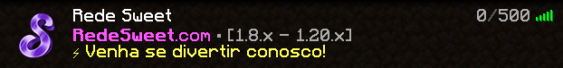
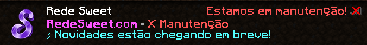

# 👋 Introdução

> Aqui você aprenderá tudo sobre a Rede Sweet e seus modos de jogo.
>
> Desde ajuda para conexão, regras e informações básicas até os dados mais técnicos sobre os sistemas dos modos de jogo.

## 🔗 Conexão

#### IP & Versão:

* redesweet.com
* 1.8.x até 1.20.x - é aconselhado o uso da versão 1.8.9 para uma melhor experiência.

<figure><figcaption>
A Rede Sweet deve aparecer corretamente na sua lista de servidores.
</figcaption></figure>

## 🛠️ Reinício & Manutenção

#### Reinício:

Todo dia às 6h da manhã todos os servidores da rede (incluindo os lobbies e proxies) são reiniciados de forma automática. Isso é necessário para manter a qualidade da infraestrutura. Leva de 1-3 minutos.

#### Manutenção:

A Rede Sweet passa por atualizações periodicamente para manter a qualidade de seus sistemas e servidores. Eventualmente, é possível que mantenhamos a rede em manutenção por um curto período como 1-2 horas para melhorias. Você verá a Sweet na lista de servidores, mas não poderá se conectar.

<figure><figcaption>
A Sweet aparecerá na lista de servidores marcada como "Em manutenção".
</figcaption></figure>

***


Caso precise de ajuda relacionada à conexão ou qualquer outra questão, entre em contato conosco em nosso Discord: [https://redesweet.com/discord](https://redesweet.com/discord)

